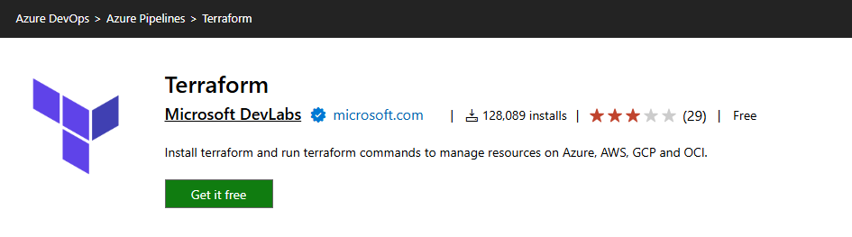
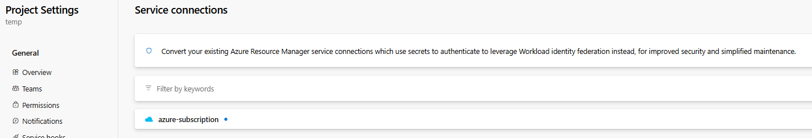
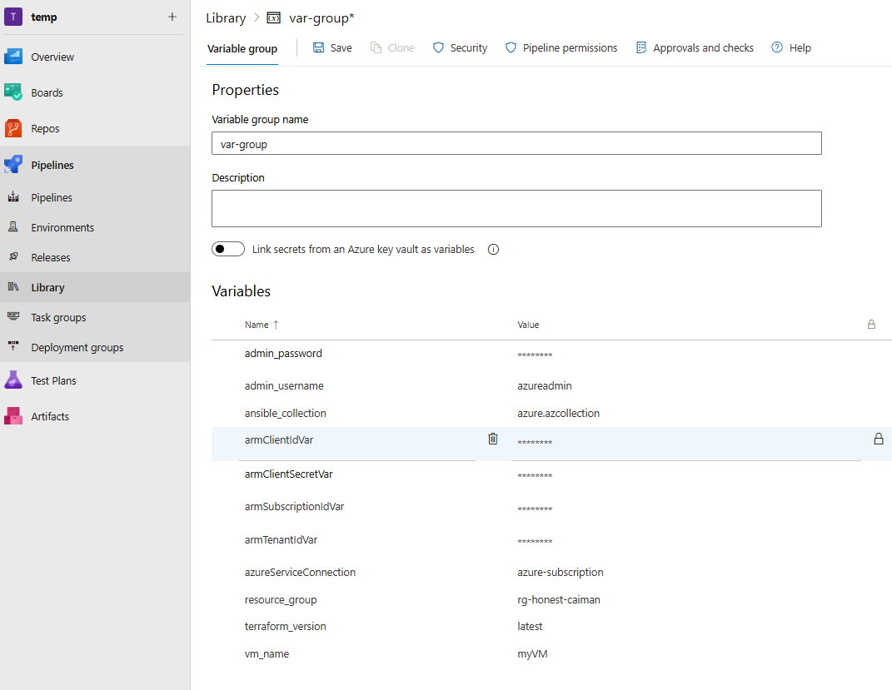
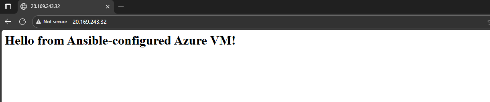

# Azure VM Deployment Test

## Workflow and folder Structure
```python
1- Create Terraform files.
2- Create Ansible Playbook.
3- Create Azure Pipeline.
```

## Folder Structure
```python
│   .gitignore
│   azure-pipeline.yml
│   Readme.md
│
├───Ansible
│       playbook.yml
│
└───Terraform
    │   .terraform.lock.hcl
    │   backend.tf
    │   main.tf
    │   outputs.tf
    │   providers.tf
    │   terraform.tfstate
    │   terraform.tfstate.backup
    │   variables.tf
```


## Prerequisites
- create a github repo to push our scripts on it
- Azure subscription with service principal.
- blobStorage for terrafrom backend in seperate RG of the RG of the project
- Terraform Plugins
- Terraform and Ansible installed locally (or use Cloud Shell).
- Azure DevOps project with permissions.
- using the variable group to set our variables with keeping the sensitive data secured

-------------------------------------
## Scren-shots

## Install the terrafrom extension


## set the azure subscription Service


## Create a Variable Group



## Screen-Shot from succseded pipeline


## vm after provisioned and configured
