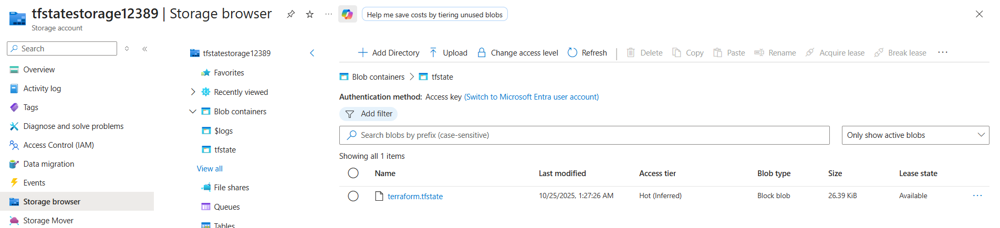
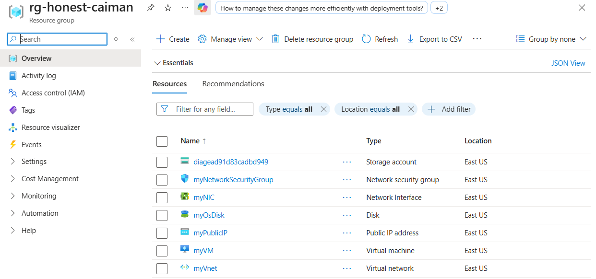

# Azure VM Deployment Test

## 🔹 Workflow and folder Structure
```python
1- Create Terraform files.
2- Create Ansible Playbook.
3- Create Azure Pipeline.
```

## 🔹 Folder Structure
```python
│   .gitignore
│   azure-pipeline.yml
│   Readme.md
│
├───Ansible
│       playbook.yml
│
└───Terraform
    │   .terraform.lock.hcl
    │   backend.tf
    │   main.tf
    │   outputs.tf
    │   providers.tf
    │   terraform.tfstate
    │   terraform.tfstate.backup
    │   variables.tf
```


## 🔹 Prerequisites

Before running the pipeline or executing Terraform/Ansible scripts, ensure the following prerequisites are met:

1. **GitHub Repository**

   * Create a public GitHub repository to store and version-control all Terraform, Ansible, and pipeline scripts.

2. **Azure Subscription & Service Principal**

   * You must have an active Azure subscription.
   * Create a **Service Principal** with **Contributor** role to allow Terraform and Ansible to deploy resources.

3. **Terraform Backend Storage**

   * Set up an **Azure Blob Storage Account** in a **separate Resource Group** (not the project RG) to store Terraform state (`tfstate`).
   * This ensures **remote state management** and allows idempotent deployments.

4. **Terraform Plugins**

   * Install necessary Terraform providers, e.g., `azurerm`, `random`, etc., either locally or via `terraform init`.

5. **Terraform & Ansible Installation**

   * **Locally:** Install Terraform and Ansible CLI with the required Azure collections (`azure.azcollection`).

6. **Azure DevOps Project**

   * Create a project in Azure DevOps with sufficient permissions to create pipelines and access service connections.
   * Configure a **Service Connection** for the Azure subscription.
   * Install Terraform Plugins in you organization

7. **Variable Group for Pipeline**

   * Use a **Variable Group** in Azure DevOps to define all required variables (e.g., `resource_group`, `vm_name`, `admin_username`, `admin_password`).
   * Mark sensitive variables as **secret** to keep credentials secure.


## 🔹 Screennshots

## Install the terrafrom extension


## Create the azure subscription Service


## Create a Variable Group


## Succseded pipeline


## tfstate on the bazkend 



## Resources after provisioned



## VM after provisioned and configured


